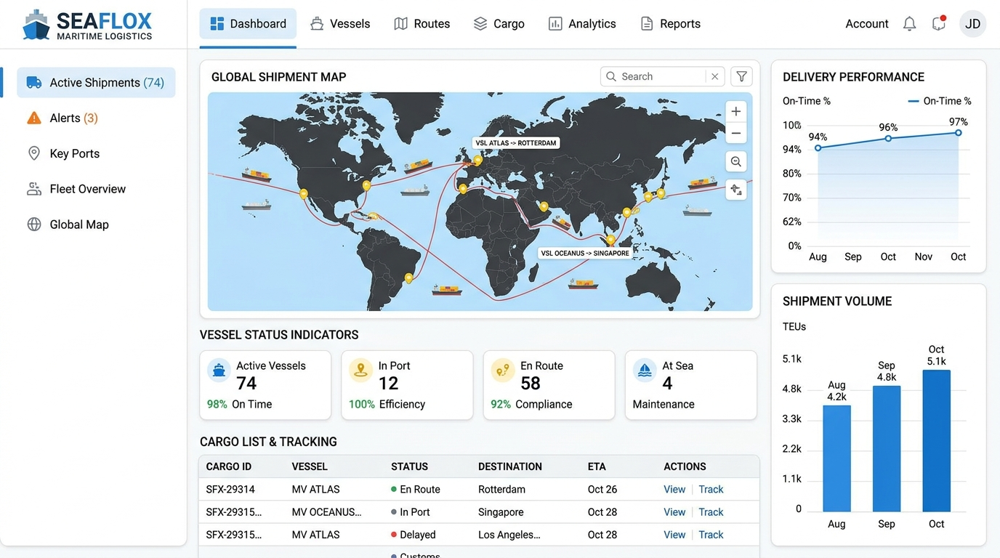

# Orca Denizcilik - Müşteri Arayüzü Portal Projesi

Orca Denizcilik projesinin web arayüzü olup, deniz lojistiği süreçlerini, seferleri ve gemi detaylarını kullanıcıya sunan ön yüz/web portalı uygulamasıdır.

## 🚀 Kullanılan Teknolojiler
* **Mimari:** ASP.NET Core MVC
* **Tasarım:** HTML, CSS, JavaScript, Bootstrap, Responsive tasarım şablonu
* **API Entegrasyonu:** `orcadenizcilikapi` ile entegre çalışacak şekilde tasarlanmıştır.

## ✨ Özellikler / Yapı
* Gemi seferleri ve kargo takibi için kullanıcı dostu arayüz.
* Mobil uyumlu tasarım.
* Dinamik içerik sunumu.

## 🛠️ Nasıl Çalıştırılır?
1. Projeyi Visual Studio 2022 ile açın.
2. `orcadenizcilikapi` projesinin arka planda çalıştığından emin olun veya projeyi bağımsız olarak statik şekilde test edin.
3. `dotnet run` veya F5 ile projeyi başlatın.
